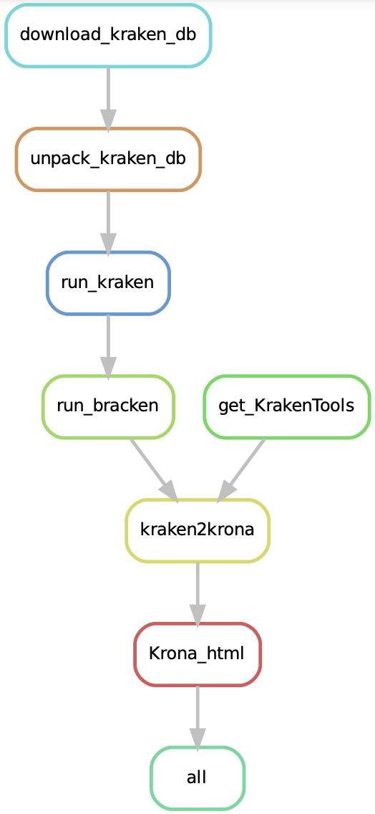
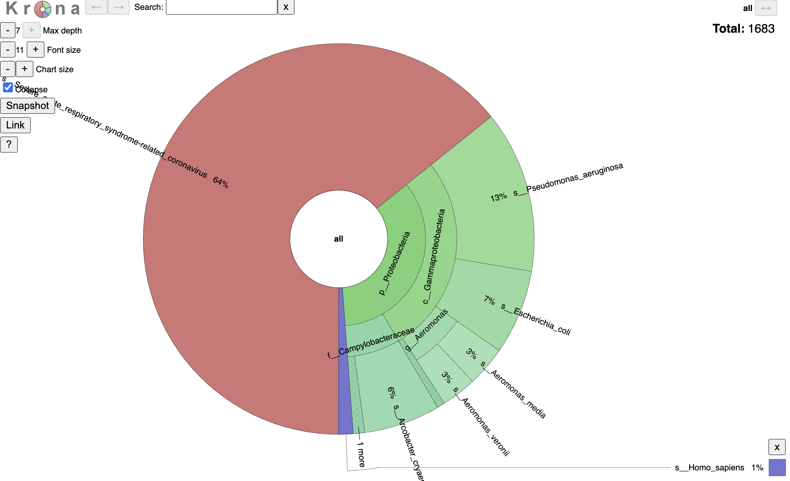

# Wastewater metagenome visualization with Kraken2

## Background and Rationale
Throughout the COVID-19 pandemic, epidemiological surveillance has been conducted via molecular tests (including nucleic acid tests such as PCR or LAMP, and rapid antigen tests) and whole genome sequencing of associated samples. More recently, wastewater surveillance has been growing in popularity as a method to monitor the SARS-CoV-2 viral load within a population without placing the burden of seeking out molecular tests on individuals within that population [[1]](#1).

Wastewater samples provide a valuable opportunity to examine not only the viral load associated with SARS-CoV-2 prevalence within a population, but can also be extended to monitor other pathogens of interest or traits such as antimicrobial resistance [[2]](#2). After genome sequencing, taxonomic classification tools such as Kraken2 can be used to identify the organisms present in a wastewater sample [[3]](#3). Bracken can subsequently be used to estimate organisms abundances directly from the sequencing data, providing a snapshot of the microbial and viral population present within the sample [[4]](#4). 

This workflow begins with the base-called sequencing results from a wastewater sample collected at a Canadian municipal wastewater treatment facility. The sample was sequenced with the intention of performing SARS-CoV-2 surveillance. The full sequencing protocol is described in a preprint from [[Landgraff et al]](#5), but briefly includes the generation of a PCR amplicon library and sequencing on a Mk1b MinION sequencer. Sequencing results were obtained from NCBI BioProject PRJNA708265 and BioSample accession SAMN18228019. The workflow closely follows the steps detailed in Lu's _Metagenome Analysis Using the Kraken Software Suite_ article under the 'Microbiome Analysis' section [[6]](#6), and includes taxonomic classification with Kraken2, organism abundance estimation with Bracken, and visualization with Krona [[7]](#7), which are all included as package dependencies in the `envs/conda.yaml` file. Interestingly, although the sequencing strategy targeted SARS-CoV-2, the workflow results show the presence of a number of unknown and bacterial sequences. 





## Usage

This repo contains all the materials required to execute the workflow on the included SARS-CoV-2 wastewater sequencing results. To run the workflow, first clone the repo using: 

`git clone https://github.com/Mach-2/BIOF501A`

Next, navigate into the cloned directory. After activating the snakemake environment, the workflow can be executed. 

```
cd BIOF501A
conda activate snakemake
snakemake --use-conda --cores 1
```

### Requirements: 
* SARS-CoV-2 amplicon sequencing results, available from [NCBI](https://trace.ncbi.nlm.nih.gov/Traces/?view=run_browser&acc=SRR13912812&display=metadata) and included in `workflow/reads/SRR13912812.fastq`
* Kraken2, Bracken, and Krona, included in the `workflow/envs/conda.yaml` file 
  * Note: Bracken version 2.8 is currently available according to the Bracken github repository. Version 2.8 would not install via conda in the class.cidgoh environment, so version 2.6.2 is specified instead.

## Input
The input data is the fastq sequencing results from a SARS-CoV-2 wastewater surveillance sequencing project. 
The other main input is the Kraken2 database, which is downloaded and unpacked as part of the workflow. 

## Output
The final output of the workflow is the `Metagenome.krona.html` file, which provides a visualization of the Bracken abundance estimates. The Krona visualization can be opened and explored interactively in any web browser. 



While this sample shows a high prevalence of SARS-CoV-2-associated sequences, the successfully-classified reads includes over 35% bacterial sequences. Investigating the kraken2 report (`kreports/SRR13912812.k2report` also shows that over 70% of the reads from the original sample could not be assigned to a taxonomic classification. Using a different Kraken2 database or different settings may help to match some of the unidentified sequences to a taxonomic classification if they are the result of the pipeline not being able to classify reads with high specificity. However, the bacterial sequences may be the result of off-target sequencing results. Even though the original experiment was intended to capture SARS-CoV-2 prevalence, additional information about other species in the original sample is contained within the sequence data. 


## References: 
<a id="1">[1]</a> 
I. Michael-Kordatou, P. Karaolia, and D. Fatta-Kassinos, “Sewage analysis as a tool for the COVID-19 pandemic response and management: the urgent need for optimised protocols for SARS-CoV-2 detection and quantification,” Journal of Environmental Chemical Engineering, vol. 8, no. 5, p. 104306, Oct. 2020, doi: 10.1016/j.jece.2020.104306

<a id="2">[2]</a> 
Sabri N.A., Schmitt H., Van der Zaan B., Gerritsen H.W., Zuidema T., Rijnaarts H.H., Langenhoff A.A. Prevalence of antibiotics and antibiotic resistance genes in a wastewater effluent-receiving river in the Netherlands. J. Environ. Chem. Eng. 2020;8:102245. doi: 10.1016/j.jece.2018.03.004.

<a id="3">[3]</a> 
Wood DE, Lu J, Langmead B. Improved metagenomic analysis with Kraken 2 (2019). Genome Biology. 2019 Nov;p. 76230

<a id="4">[4]</a>
Lu J, Breitwieser FP, Thielen P, Salzberg SL. (2017) Bracken: estimating species abundance in metagenomics data. PeerJ Computer Science 3:e104, doi:10.7717/peerj-cs.104

<a id="5">[5]</a>
Landgraff, C., Wang, L. Y. R., Buchanan, C., Wells, M., Schonfeld, J., Bessonov, K., Ali, J., Robert, E., & Nadon, C. (2021). Metagenomic sequencing of municipal wastewater provides a near-complete SARS-CoV-2 genome sequence identified as the B.1.1.7 variant of concern from a Canadian municipality concurrent with an outbreak (p. 2021.03.11.21253409). medRxiv. https://doi.org/10.1101/2021.03.11.21253409

<a id="6">[6]</a> 
Lu, J., Rincon, N., Wood, D.E. et al. Metagenome analysis using the Kraken software suite. Nat Protoc 17, 2815–2839 (2022). https://doi.org/10.1038/s41596-022-00738-y

<a id="7">[7]</a>
Ondov BD, Bergman NH, and Phillippy AM. Interactive metagenomic visualization in a Web browser. BMC Bioinformatics. 2011 Sep 30; 12(1):385.
